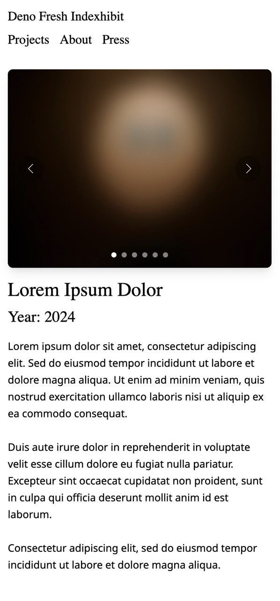

# Deno Fresh Indexhibit portfolio boiler? you're welcome

The indexhibit theme is a classic, and i felt like giving it a go as a way of getting to know Deno and Fresh. Currently i haven't implemented any cms, but within the routes/data/... you can easily swap out the curr placeholder content for your own. 

## How to?

```
deno task start
```

Boiiiom! Your indexhibit-style site is up and running. I kept the styling lowkey, in hopes that it would be most intuitive to build this into something completely different!

## Screenshots

### Desktop


### Mobile




## ...

[](https://deno.com)
[](https://fresh.deno.dev)

